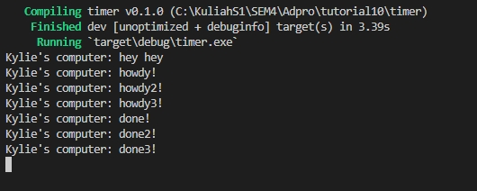

### 1.2 Explanation

Karena program untuk mencetak howdy dan done dijalankan secara asynchronous, maka program utama terus lanjut dieksekusi dan menjalankan baris untuk mencetak pesan hey hey. Eksekusi tadi terjadi sambil program mencetak howdy dan done terus dijalankan dan baru selesai dieksekusi setelah tercetak pesan hey hey. Maka dari itu, terciptalah output seperti pada foto di atas.

### 1.3 Explanation

Pada eksekusi di atas, saya telah menghapus statement drop(spawner) dan menambahkan statement spawner.spawn menjadi ada tiga. Terlihat ada 3 program yang dieksekusi bersamaan secara asinkronus dari urutan tercetaknya. Ada tiga task yang tercipta karena syntax spawn yang dipanggil 3 kali dimana ketiganya akan masuk ke dalam task sender. Executor akan memulai eksekusi suatu task baru dengan cara mengambilnya dari task sender. Karena program berjalan secara asinkronus, maka meski task pertama belum selesai dieksekusi, executor akan mengambil task selanjutnya untuk mulai dieksekusi.
Penghapusan statement drop(spawner) menyebabkan program tidak berhenti karena menunggu adanya task selanjutnya. Hal ini karena spawner mendapat pertanda bahwa task sudah selesai dieksekusi semua dengan statement drop tersebut. Maka dari itu, syntax ini diperlukan untuk mengakhiri program.